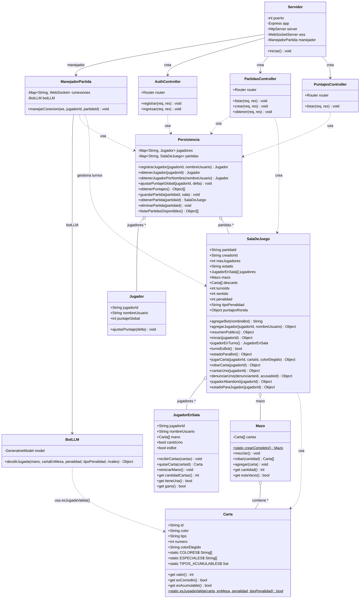

```mermaid
classDiagram
    direction TB

    %% ─── Modelos de dominio ───

    class Carta {
        +String id
        +String color
        +String tipo
        +int numero
        +String colorElegido
        +get valor() int
        +get esComodin() bool
        +get esAcumulable() bool
        +static esJugadaValida(carta, enMesa, penalidad, tipoPenalidad)$ bool
        +static COLORES$ String[]
        +static ESPECIALES$ String[]
        +static TIPOS_ACUMULABLES$ Set
    }

    class Mazo {
        -Carta[] cartas
        +static crearCompleto()$ Mazo
        +mezclar() void
        +robar(cantidad) Carta[]
        +agregar(carta) void
        +get cantidad() int
        +get estaVacio() bool
    }

    class Jugador {
        +String jugadorId
        +String nombreUsuario
        +int puntajeGlobal
        +ajustarPuntaje(delta) void
    }

    class JugadorEnSala {
        +String jugadorId
        +String nombreUsuario
        +Carta[] mano
        +bool cantóUno
        +bool esBot
        +recibirCartas(cartas) void
        +quitarCarta(cartaId) Carta
        +reiniciarMano() void
        +get cantidadCartas() int
        +get tieneUna() bool
        +get gano() bool
    }

    %% ─── Lógica de juego ───

    class SalaDeJuego {
        +String partidaId
        +String creadorId
        +int maxJugadores
        +String estado
        +JugadorEnSala[] jugadores
        +Mazo mazo
        +Carta[] descarte
        +int turnoIdx
        +int sentido
        +int penalidad
        +String tipoPenalidad
        +Object puntajesRonda
        +agregarBot(nombreBot) String
        +agregarJugador(jugadorId, nombreUsuario) Object
        +resumenPublico() Object
        +iniciar(jugadorId) Object
        +jugadorEnTurno() JugadorEnSala
        +turnoEsBot() bool
        +estadoParaBot() Object
        +jugarCarta(jugadorId, cartaId, colorElegido) Object
        +robarCarta(jugadorId) Object
        +cantarUno(jugadorId) Object
        +denunciarUno(denuncianteId, acusadoId) Object
        +jugadorAbandonó(jugadorId) Object
        +estadoParaJugador(jugadorId) Object
    }

    class BotLLM {
        -GenerativeModel model
        +decidirJugada(mano, cartaEnMesa, penalidad, tipoPenalidad, rivales) Object
    }

    %% ─── Persistencia ───

    class Persistencia {
        -Map~String, Jugador~ jugadores
        -Map~String, SalaDeJuego~ partidas
        +registrarJugador(jugadorId, nombreUsuario) Jugador
        +obtenerJugador(jugadorId) Jugador
        +obtenerJugadorPorNombre(nombreUsuario) Jugador
        +ajustarPuntajeGlobal(jugadorId, delta) void
        +obtenerPuntajes() Object[]
        +guardarPartida(partidaId, sala) void
        +obtenerPartida(partidaId) SalaDeJuego
        +eliminarPartida(partidaId) void
        +listarPartidasDisponibles() Object[]
    }

    %% ─── WebSocket ───

    class ManejadorPartida {
        -Map~String, WebSocket~ conexiones
        -BotLLM botLLM
        +manejarConexion(ws, jugadorId, partidaId) void
    }

    %% ─── Rutas HTTP ───

    class AuthController {
        +Router router
        +registrar(req, res) void
        +ingresar(req, res) void
    }

    class PartidasController {
        +Router router
        +listar(req, res) void
        +crear(req, res) void
        +obtener(req, res) void
    }

    class PuntajesController {
        +Router router
        +listar(req, res) void
    }

    %% ─── Servidor ───

    class Servidor {
        -int puerto
        -Express app
        -HttpServer server
        -WebSocketServer wss
        -ManejadorPartida manejador
        +iniciar() void
    }

    %% ─── Relaciones ───

    Mazo o-- Carta : contiene *
    SalaDeJuego o-- JugadorEnSala : jugadores *
    SalaDeJuego o-- Mazo : mazo
    SalaDeJuego ..> Carta : usa
    BotLLM ..> Carta : usa esJugadaValida()
    Persistencia o-- Jugador : jugadores *
    Persistencia o-- SalaDeJuego : partidas *
    ManejadorPartida --> BotLLM : botLLM
    ManejadorPartida ..> Persistencia : usa
    ManejadorPartida ..> SalaDeJuego : gestiona turnos
    AuthController ..> Persistencia : usa
    PartidasController ..> Persistencia : usa
    PartidasController ..> SalaDeJuego : crea
    PuntajesController ..> Persistencia : usa
    Servidor --> ManejadorPartida : manejador
    Servidor --> AuthController : crea
    Servidor --> PartidasController : crea
    Servidor --> PuntajesController : crea
```
